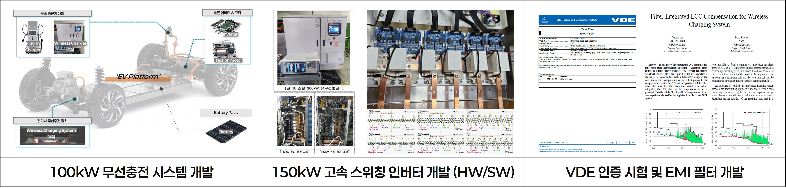
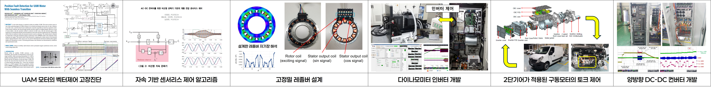

<h2>
  이태연
   
  <i>Taeyeon Lee</i>
</h2>

<b>이력 키워드</b>

## 요약
<table>
<tr>
<td rowspan="2" width="120" align="center">

</td>

<td>
▪ 생년월일 : 1993.04.16 (만 32세)
</td>

<td>
▪ 최종학위 : 전자전기공학 박사 (POSTECH)
</td>

<td>
▪ 주전공 : 모터제어 및 전력전자
</td>

</tr>
<tr>

<td>

▪ E-mail : xodus2848@naver.com

</td>

<td>
▪ 이전 소속 : ㈜와이파워원 (KAIST Spin-off)
</td>
<td>
▪ 병역 : 복무완료(특례)
</td>

</tr>
</table>

---
## 학력
&#9632; <b>Ph.D., Electrical Engineering</b> Pohang University of Science and Technology (POSTECH), 2018 – 2022
<ul>
<li><b>박사학위 논문명 :</b> <i> Torque control based speed synchronization for two-speed gear system</i>, (2022)</li>
</ul> 

&#9632; <b>M.S., Electrical Engineering</b> Pohang University of Science and Technology (POSTECH), 2016 – 2018
<ul>
<li><b>석사학위 논문명 :</b> <i> Analytical Loss Minimizing Gear Shift based on Optimal Current Sets for IPMSM</i>, (2018)</li>
</ul> 

&#9632; <b>B.S., Electrical Engineering</b> Chungbuk National University, 2012 – 2016

---

## 경력

&#9632; <b>(주)와이파워원 기업부설연구소</b> 연구소장 (Project Manager), 2026
<ul>
<li><b> 주요 프로젝트 :</b> <i> 50kW급 배터리 일체형 급속 무선충전 기술개발</i>, 한국산업기술기획평가원(KEIT), 2025-2026</li>
</ul>

&#9632; <b>(주)와이파워원 선행연구팀</b> 팀장, 책임연구원, 2024 – 2026
<ul>
<li><b> 주요 프로젝트 :</b> <i> 100kW 2상2계층 무선충전 시스템 개발</i>, 현대자동차 남양연구소, 2024-2026</li>
</ul>

&#9632; <b>(주)와이파워원 인버터팀</b> 선임연구원, 2022 – 2024
<ul>
<li><b>주요 프로젝트 :</b> <i> Oak Ridge National Lab. 기술 대응을 위한 3상3계층 코일 및 무선충전 인버터 개발</i>, Post-Tips, (2023-2024)</li>
</ul> 

▶ <b>수행 프로젝트 (소속: (주)와이파워원)</b>

- <b>100kW 2상2계층 무선충전 시스템 개발;</b> 고속 스위칭(85kHz) 인버터 모듈 개발 및 전력변환부 원리시험, 현대자동차 남양연구소, 2024-2026
- <b>상용차용 3상3계층 기반의 무선충전 코일 기술개발;</b> 국제 e-모빌리티 신기술 수상(2026), Post-Tips, 2023-2024
- <b>대전 특구 무선충전 버스 개발 및 충전기 VDE 인증 시험 참여;</b> EMI CE/RE 극복을 위한 차동 및 동상모드 통합형 필터 개발, 2022-2023

▶ <b>수행 프로젝트 (소속: 포항공과대학교)</b>

- <b>UAM 고출력 모터 제어 알고리즘 개발;</b> 센서 Failover를 위한 자속 관측기 기반 센서리스 및 센서 융합 제어 기술 개발, 현대자동차, 2019-2020
- <b>계통 연계 AC/DC 컨버터의 전압 센서리스 기술개발;</b> 자속 기반 Adaptive Quadrauture PLL 개발, POSTECH, 2020-2020
- <b>고정밀 벡터 제어를 위한 레졸버 설계;</b> 타마가와 레졸버 국산활ㄹ 위한 자체 연구개발, POSTECH, 2018-2029
- <b>유도모터 기반 다이나모미터의 인버터 SW/HW 개발;</b> 구동 모터 시험을 위한 테스트 장비 개발 (간접 벡터 제어), EPT & KNR, 2017-2018
- <b>2단 기어가 적용된 구동모터의 토크 제어 개발;</b> 모터 손실 기반의 변속맵 도출 및 변속충격 완화를 위한 토크 제어기법, KEIT, 2016-2020
- <b>양방향 DC/DC 컨버터 개발/납품;</b> 구동모터 시험을 위한 배터리 시뮬레이터 장비 개발, EPT & ANG & 현대기아환경기술연구소 , 2020-2021

---

## 연구논문(해외)

&#9632; <b>SCI</b>
<ul>
<li><b> T. Lee</b> and K. Nam, <i> Torque Control Based Speed Synchronization for Two-Speed Gear Electric Vehicle,</i>, in IEEE Access, vol. 9, pp. 153518-153527, 2021. 🔗 DOI: https://doi.org/10.1109/ACCESS.2021.3127368 </li>
</ul>

<ul>
<li><b> T. Lee</b> , H. Lee, P. Jang, Y. Hwang and K. Nam, <i> Position Fault Detection for UAM Motor With Seamless Transition,</i>, in IEEE Access, vol. 9, pp. 168042-168051, 2021. 🔗 DOI: https://doi.org/10.1109/ACCESS.2021.3134911 </li>
</ul>

<ul>
<li>B. Jung, <b> T. Lee</b> and K. Nam, <i> Overmodulation Strategy for Voltage Source Inverter With a Single DC-Link Current Sensor,</i>, in IEEE Transactions on Industry Applications, vol. 58, no. 1, pp. 531-540, Jan.-Feb. 2022. 🔗 DOI: https://doi.org/10.1109/TIA.2021.3128585 </li>
</ul>

<ul>
<li>P. Jang, <b> T. Lee</b>, Y. Hwang and K. Nam, <i> Quadrature Demodulation Method for Resolver Signal Processing Under Different Sampling Rate,</i>,  in IEEE Access, vol. 10, pp. 7016-7024, 2022. 🔗 DOI: https://doi.org/10.1109/ACCESS.2021.3136770 </li>
</ul>

&#9632; <b>비 SCI</b>
<ul>
<li><b> T. Lee</b>, <i> A Novel Three-Phase Three-Layer Topology for Wireless Power Transfer Systems,</i>, in IEEE Access, vol. 9, pp. 153518-153527, 2021. 🔗 DOI: https://doi.org/10.1109/ECCEEurope62508.2024.10751830 </li>
</ul>

<ul>
<li><b> T. Lee</b> and D. -H. Cho, <i> Filter-Integrated LCC Compensation for Wireless Charging System,</i>, 2023 IEEE Applied Power Electronics Conference and Exposition (APEC), Orlando, FL, USA, 2023. 🔗 DOI: https://doi.org/10.1109/APEC43580.2023.10131634 </li>
</ul>

<ul>
<li><b> T. Lee</b>, H. Lee, B. Koo and K. Nam, <i> Position Fault Detection and Failover Method for UAM PMSM Control</i>, 2021 IEEE Energy Conversion Congress and Exposition (ECCE), Vancouver, BC, Canada, 2021. 🔗 DOI: https://doi.org/10.1109/ECCE47101.2021.9594929 </li>
</ul>

<ul>
<li><b> T. Lee</b>, K. Nam, J. Kang and Y. Ahn, <i> Synchronized Gear Shift Control Using RLS Estimator for Two Speed Gear System,</i>, 2020 IEEE Transportation Electrification Conference & Expo (ITEC), Chicago, IL, USA, 2020. 🔗 DOI: https://doi.org/10.1109/ITEC48692.2020.9161748 </li>
</ul>

<ul>
<li><b> T. Lee</b>, Y. Kim and K. Nam, <i> Loss minimizing gear shifting algorithm based on optimal current sets for IPMSM,</i>, 2017 IEEE Transportation Electrification Conference and Expo (ITEC), Chicago, IL, USA, 2017. 🔗 DOI: https://doi.org/10.1109/ITEC.2017.7993260 </li>
</ul>

---
## 연구논문(국내)

<ul>
<li><b> 이태연</b>, <i> 디커플링 구조를 갖는 3상3계층 무선충전 시스템,</i>, 전력전자학회 학술대회, 2024.   🔗 https://dbpia.co.kr/journal/articleDetail?nodeId=NODE11865443 </li>
</ul>

<ul>
<li><b> 이태연</b>, 황윤경, 이민혁, 남광희, <i> AC-DC 컨버터를 위한 비선형 관측기 기반의 계통 전압 센서리스 제어,</i>, 대한전기학회 학술대회, 2021.   🔗https://dbpia.co.kr/journal/articleDetail?nodeId=NODE10755792  </li>
</ul>

<ul>
<li><b> 이태연</b>, 남광희, <i> 각도 센서 융합을 통한 전동기 벡터 제어 페일오버 기법,</i>, 대한전기학회 CICS´ 20 정보 및 제어 학술대회, 2020. 
  🔗https://dbpia.co.kr/journal/articleDetail?nodeId=NODE10492584 </li>
</ul>

<ul>
<li><b> 이태연</b>, 남광희, <i> 전동기 제어를 위한 고성능 릴럭턴스 레졸버 설계,</i>, 전력전자학회 학술대회, 2019.  
  🔗https://dbpia.co.kr/journal/articleDetail?nodeId=NODE09265268 </li>
</ul>

<ul>
<li><b> 이태연</b>, 남광희, <i> 직접 전압 인가 방식을 이용한 인버터의 전압 왜곡 보상,</i>, 전력전자학회 학술대회, 2018.  
  🔗https://dbpia.co.kr/journal/articleDetail?nodeId=NODE07578800 </li>
</ul>

<ul>
<li><b> 이태연</b>, 남광희, <i> 2단 기어를 통한 전기자동차의 모터와 인버터의 효율 개선,</i>, 전력전자학회 학술대회, 2016.  
  🔗https://www.dbpia.co.kr/journal/articleDetail?nodeId=NODE07066250 </li>
</ul>

---
## 저서
<ul>
<li><b> 이태연</b>. 2025. <i> 전기의 요정 (La Fée Électricité),</i>, 동아시아 출판사. 📖ISBN : 9788962626681 </li>
</ul>

---
## 특허

 <b>1028195220000, "모터각도 산출방법"</b>,
공동발명자, 출원국가 대한민국, 등록일자 2025.06.09 등록  

 <b>1027987010000, "EMI 필터가 통합된 무선충전 보상회로"</b>,
주발명자, 출원국가 대한민국, 등록일자 2025.04.16 등록  

 <b>1020250052272, "DC-DC 컨버터를 이용하여 넓은 동작 범위를 지원하는 무선충전 송신장치 및 그 제어 방법 "</b>,
주발명자, 출원국가 대한민국, 등록일자 2025.10.29 등록  

---
## 사용가능 툴

---

